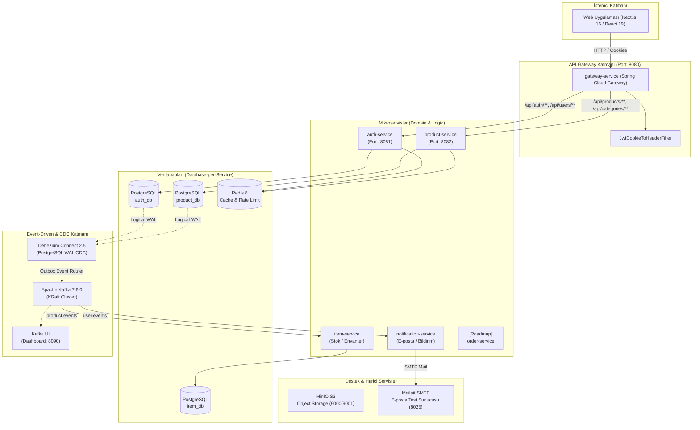
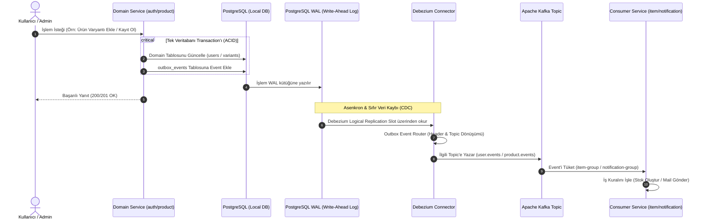
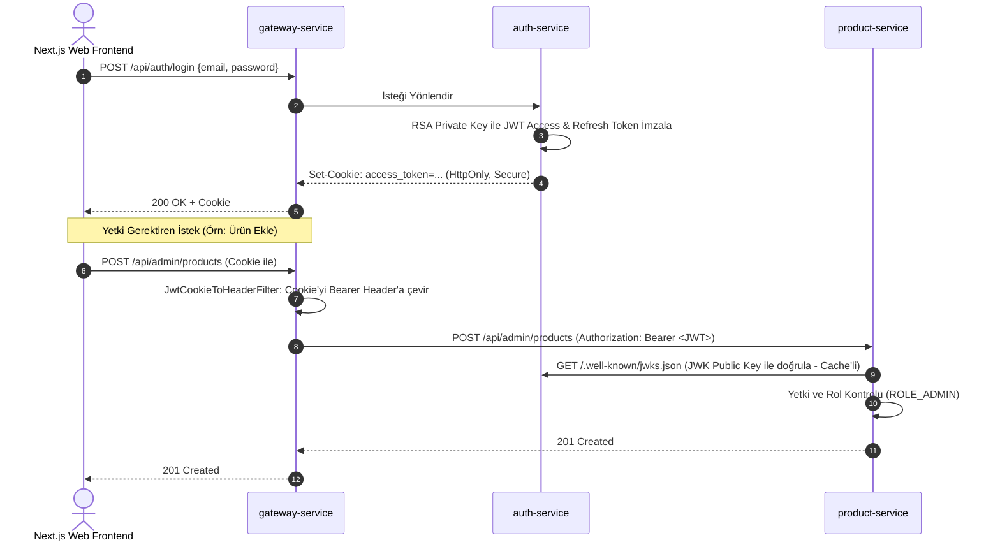

# 🛒 Vestra — Event-Driven E-Commerce Microservices Platform

<p align="center">
  
  
  
  
  
  
  
  
  
  
</p>

**Vestra**, modern yazılım mühendisliği prensipleri (Event-Driven Architecture, Transactional Outbox Pattern, Change Data Capture - CDC, Database-per-Service) ile tasarlanmış, yüksek ölçeklenebilir ve dayanıklı bir e-ticaret mikroservis ekosistemidir.

---

## 📑 İçindekiler

- [Sistem Mimarisi](#-sistem-mimarisi)
  - [Genel Bakış Şeması](#genel-bakış-şeması)
  - [Transactional Outbox & CDC Veri Akışı](#transactional-outbox--cdc-veri-akışı)
  - [Kimlik Doğrulama (Auth) & Gateway Akışı](#kimlik-doğrulama-auth--gateway-akışı)
- [Kullanılan Teknolojiler (Tech Stack)](#-kullanılan-teknolojiler-tech-stack)
- [Mikroservisler ve Modüller](#-mikroservisler-ve-modüller)
- [Mimari Kararlar ve Öne Çıkan Özellikler](#-mimari-kararlar-ve-öne-çıkan-özellikler)
- [Kafka Event & Topic Yapısı](#-kafka-event--topic-yapısı)
- [Altyapı ve Docker Servisleri](#-altyapı-ve-docker-servisleri)
- [Kurulum ve Başlangıç (Getting Started)](#-kurulum-ve-başlangıç-getting-started)
  - [1. Önkoşullar](#1-önkoşullar)
  - [2. Altyapıyı Başlatma (Docker Compose)](#2-altyapıyı-başlatma-docker-compose)
  - [3. Debezium Connector'larını Kaydetme](#3-debezium-connectorlarını-kaydetme)
  - [4. Backend Servislerini Çalıştırma](#4-backend-servislerini-çalıştırma)
  - [5. Frontend (Next.js) Uygulamasını Başlatma](#5-frontend-nextjs-uygulamasını-başlatma)
- [Proje Dizin Yapısı](#-proje-dizin-yapısı)
- [Gelecek Yol Haritası (Roadmap)](#-gelecek-yol-haritası-roadmap)

---

## 🏛️ Sistem Mimarisi

Vestra, monolitik bağımlılıkları tamamen ortadan kaldıran, servisler arası gevşek bağlılığı (loose coupling) ve nihai tutarlılığı (eventual consistency) merkezine alan bir mimariye sahiptir.

### Genel Bakış Şeması



---

### Transactional Outbox & CDC Veri Akışı

Doğrudan servis içinden Kafka'ya mesaj göndermek "Dual-Write" problemine (veritabanına yazılıp Kafka'ya yazılamaması veya tam tersi) yol açar. Vestra bu problemi **Transactional Outbox Pattern** ve **Debezium CDC (Change Data Capture)** ile çözer:



---

### Kimlik Doğrulama (Auth) & Gateway Akışı

Vestra, istemci tarafında güvenli **HttpOnly/Secure Cookie** yaklaşımını benimserken mikroservisler arasında **Stateless Asymmetric JWT (RSA 2048)** standardını kullanır:



---

## 🛠️ Kullanılan Teknolojiler (Tech Stack)

### Backend & Mikroservis Mimarisi
- **Dil & Runtime:** Java 25 (OpenJDK)
- **Framework:** Spring Boot 4.1.1 & Spring Framework 7
- **API Gateway:** Spring Cloud Gateway (Reactive WebFlux tabanlı, non-blocking I/O)
- **Güvenlik & Auth:** Spring Security, OAuth2 Resource Server & Client (Google Social Login desteği)
- **Veri Erişimi & ORM:** Spring Data JPA, Hibernate, PostgreSQL JDBC Driver
- **Veritabanı Migration:** Flyway (`flyway-database-postgresql`)
- **Eşleme & DTO:** MapStruct 1.6.3 & Lombok
- **Doğrulama:** Spring Boot Starter Validation (Hibernate Validator & Custom Annotations)
- **E-posta & Şablon:** Spring Boot Mail, Thymeleaf HTML Template Engine

### Mesajlaşma, Event-Driven & CDC
- **Mesaj Broker:** Apache Kafka 7.6.0 (KRaft modunda, Zookeeper bağımlılığı olmaksızın)
- **Change Data Capture (CDC):** Debezium Connect 2.5 (`io.debezium.transforms.outbox.EventRouter`)
- **Kafka İstemcisi:** Spring Kafka (`@KafkaListener`, `JsonConverter`)
- **Görselleştirme:** Provectus Kafka UI (Cluster, Topic ve Consumer Group izleme)

### Veritabanı, Önbellek ve Depolama
- **İlişkisel Veritabanı:** PostgreSQL 18 (`wal_level=logical` ile CDC destekli)
- **In-Memory Cache & Lock:** Redis 8 (Query caching, brute-force koruması, login kilitleme)
- **Nesne Depolama (Object Storage):** MinIO (S3 uyumlu ürün görseli ve medya depolama)
- **E-posta Test Sunucusu:** Mailpit (Lokal SMTP sunucusu ve web arayüzü)

### Frontend (Web UI)
- **Framework:** Next.js 16 (App Router mimarisi) & React 19
- **Stil & Tasarım:** Tailwind CSS v4, Lucide React Icons, Radix/Base UI, shadcn bileşenleri
- **Veri Yönetimi:** TanStack React Query v5 (Server State, Caching, Revalidation)
- **Tablolar & Formlar:** TanStack Table v9, React Hook Form, Zod v4 doğrulama
- **Grafikler & Etkileşim:** Recharts v3, @dnd-kit (Sürükle-bırak desteği), Sonner Toast Notifications

---

## 📦 Mikroservisler ve Modüller

| Modül / Servis | Port | Veritabanı / Broker | Sorumluluk & Özellikler |
| :--- | :---: | :--- | :--- |
| **`gateway-service`** | `8080` | Redis Reactive | Tek giriş noktası (Reverse Proxy), Dinamik Cookie-to-Bearer Token çevirici, CORS yönetimi, merkezi yönlendirme. |
| **`auth-service`** | `8081` | `auth_db` (Postgres), Redis | Kullanıcı kaydı/girişi, RSA 2048 Asimetrik JWT üretimi, JWKS endpoint'i (`/.well-known/jwks.json`), Brute-force önleme, Google OAuth2, Outbox event üretimi. |
| **`product-service`** | `8082` | `product_db` (Postgres), Redis | Kategori, ürün, hiyerarşik varyant ve inceleme (review) yönetimi, Redis sorgu önbellekleme, varyant outbox event'leri. |
| **`item-service`** | — | `item_db` (Postgres), Kafka | Stok ve envanter yönetimi. `product.events` topic'ini dinler, yeni varyant oluştuğunda otomatik stok kaydı açar. |
| **`notification-service`** | — | Mailpit SMTP, Kafka | Asenkron bildirim servisi. `user.events` topic'ini dinler, Thymeleaf ile HTML hoş geldin ve şifre sıfırlama mailleri üretip iletir. |
| **`common`** | — | Shared Library | Servisler arası ortak DTO'lar, Event Payloads (`UserRegisteredPayload`, `VariantCreatedPayload` vb.), `Role` enum. |
| **`common-web`** | — | Shared Library | Ortak hata yönetimi (`ApiException`, `@RestControllerAdvice GlobalHandler`), Spring Boot auto-configuration desteği. |
| **`web`** | `3000` | HTTP / REST API | Next.js 16 & React 19 modern admin dashboard ve kullanıcı arayüzü (Auth sayfaları, kategori/ürün yönetimi, sipariş ön izleme). |

---

## 💡 Mimari Kararlar ve Öne Çıkan Özellikler

1. **Transactional Outbox & Debezium SMT:**
   - Servisler Kafka'ya doğrudan bağımlı değildir. Tüm domain değişiklikleri ve event kayıtları veritabanında aynı ACID transaction içinde atomik olarak kaydedilir.
   - Debezium, PostgreSQL WAL loglarını okur ve `io.debezium.transforms.outbox.EventRouter` SMT (Single Message Transformation) aracılığıyla event tipini Kafka header'ına, yükü (payload) ise mesaj gövdesine aktararak ilgili topic'e basar.
2. **Asimetrik Şifreleme ile Güvenlik (JWKS):**
   - Sadece `auth-service` özel anahtara (`private_key.pem`) sahiptir. Diğer mikroservisler (`product-service`, `item-service`) auth servisine bağımlı kalmadan açık anahtar (`public_key.pem` / JWKS endpoint) ile token doğrulaması yapar.
3. **API Gateway Seviyesinde Cookie Çözümleme:**
   - XSS açıklarını minimize etmek için frontend'e JWT token'lar `HttpOnly` cookie olarak verilir.
   - API Gateway'deki `JwtCookieToHeaderFilter`, downstream mikroservislerin Spring Security OAuth2 Resource Server standartlarıyla uyumlu çalışması için bu cookie'yi şeffaf biçimde `Authorization: Bearer <token>` başlığına dönüştürür.
4. **Brute-Force Koruması & Güvenlik:**
   - `auth-service`, Redis tabanlı `LoginAttemptService` ile ardışık başarısız oturum açma denemelerini sayar ve belirlenen eşik aşıldığında kullanıcı hesabını geçici süreyle kilitler.

---

## 📬 Kafka Event & Topic Yapısı

| Topic Adı | Kaynak Servis | Tüketici (Consumer) | Event Tipi (Header) | Açıklama |
| :--- | :--- | :--- | :--- | :--- |
| `user.events` | `auth-service` (Outbox/CDC) | `notification-service` | `USER_REGISTERED` | Yeni kullanıcı kaydolduğunda hoş geldin e-postası tetiklenir. |
| `user.events` | `auth-service` (Outbox/CDC) | `notification-service` | `PASSWORD_RESET` | Şifre sıfırlama linki ve güvenlik token'ı e-posta olarak gönderilir. |
| `product.events` | `product-service` (Outbox/CDC) | `item-service` | `VARIANT_CREATED` | Yeni ürün varyantı eklendiğinde envanterde başlangıç stoku oluşturulur. |
| `product.events` | `product-service` (Outbox/CDC) | `item-service` | `VARIANT_DELETED` | Varyant silindiğinde stok tablosundan ilgili kayıt temizlenir. |

---

## 🐳 Altyapı ve Docker Servisleri

Tüm altyapı bileşenleri [infra/docker-compose.infra.yml](file:///C:/Users/Admin/Desktop/workspaces/vestra/infra/docker-compose.infra.yml) dosyasında tanımlıdır:

| Servis Adı | Konteyner Adı | Host Portu | Konteyner İçi | Açıklama |
| :--- | :--- | :---: | :---: | :--- |
| **PostgreSQL 18** | `vestra-postgres` | `5432` | `5432` | Multi-DB (`auth_db`, `product_db`, `item_db`) + Logical WAL açık. |
| **Redis 8** | `vestra-redis` | `6379` | `6379` | Şifreli Redis sunucusu (Önbellek & Güvenlik). |
| **Apache Kafka** | `vestra-kafka` | `9092` | `29092` | Confluent CP-Kafka (KRaft Broker + Controller). |
| **Kafka UI** | `vestra-kafka-ui` | `8090` | `8080` | Kafka görsel yönetim konsolu (`http://localhost:8090`). |
| **Debezium Connect**| `vestra-debezium` | `8083` | `8083` | PostgreSQL CDC Outbox Event Router motoru. |
| **MinIO** | `minio` | `9000` / `9001` | `9000` / `9001` | S3 API (`9000`) & Web Yönetim Konsolu (`9001`). |
| **Mailpit** | `mailpit` | `1025` / `8025` | `1025` / `8025` | SMTP portu (`1025`) & Web Posta Kutusu Arayüzü (`8025`). |

---

## 🚀 Kurulum ve Başlangıç (Getting Started)

### 1. Önkoşullar
- **Java 25 SDK** (Oracle OpenJDK veya Eclipse Temurin)
- **Node.js 20+** & **npm**
- **Docker Desktop** & **Docker Compose**

### 2. Altyapıyı Başlatma (Docker Compose)

Docker ağını ve altyapı konteynerlerini ayağa kaldırın:

```bash
# Proje kök dizininde veya infra dizininde:
cd infra

# Docker network'ünü oluşturun (eğer yoksa):
docker network create vestra-network

# Konteynerleri başlatın:
docker compose -f docker-compose.infra.yml -f docker-compose.override.yml up -d
```

### 3. Debezium Connector'larını Kaydetme

Debezium servisinin başlamasını bekledikten sonra (yaklaşık 15-20 saniye), `auth-service` ve `product-service` için outbox connector'larını REST API üzerinden kaydedin:

```bash
# Auth Outbox Connector kaydı:
curl -i -X POST -H "Accept:application/json" -H "Content-Type:application/json" \
  http://localhost:8083/connectors/ -d @auth-service/debezium.txt

# Product Outbox Connector kaydı:
curl -i -X POST -H "Accept:application/json" -H "Content-Type:application/json" \
  http://localhost:8083/connectors/ -d @product-service/debezium.txt

# Aktif connector'ları kontrol etmek için:
curl -s http://localhost:8083/connectors
```

### 4. Backend Servislerini Çalıştırma

Gradle wrapper kullanarak servisleri başlatabilirsiniz. Geliştirme esnasında servisleri ayrı terminallerde veya IDE (IntelliJ IDEA) üzerinden çalıştırabilirsiniz:

```bash
# 1. Gateway Service
./gradlew :gateway-service:bootRun

# 2. Auth Service
./gradlew :auth-service:bootRun

# 3. Product Service
./gradlew :product-service:bootRun

# 4. Item Service (Stok)
./gradlew :item-service:bootRun

# 5. Notification Service (E-posta)
./gradlew :notification-service:bootRun
```

### 5. Frontend (Next.js) Uygulamasını Başlatma

```bash
cd web

# Bağımlılıkları yükleyin:
npm install

# Geliştirme sunucusunu başlatın:
npm run dev
```

Web arayüzüne **`http://localhost:3000`** üzerinden, API Gateway'e ise **`http://localhost:8080`** üzerinden erişebilirsiniz.

---

## 📂 Proje Dizin Yapısı

```text
vestra/
├── auth-service/            # Kimlik doğrulama, JWT, OAuth2 & Kullanıcı yönetimi
│   ├── src/main/resources/certs/   # RSA private & public anahtarları
│   └── debezium.txt         # Auth Debezium outbox konfigürasyonu
├── product-service/         # Ürün kataloğu, kategoriler, varyantlar, incelemeler
│   └── debezium.txt         # Product Debezium outbox konfigürasyonu
├── item-service/            # Envanter ve stok mikroservisi (Kafka Consumer)
├── notification-service/    # Asenkron e-posta bildirim servisi (Thymeleaf + SMTP)
├── gateway-service/         # Spring Cloud Gateway & JWT Cookie-to-Header filtresi
├── common/                  # Paylaşılan Event DTO'ları, Payload'lar ve Enum'lar
├── common-web/              # Global Handler & merkezi Exception mekanizması
├── infra/                   # Docker Compose, PostgreSQL init scriptleri ve .env
│   ├── init-scripts/        # Veritabanı ve kullanıcı başlatma SQL scriptleri
│   └── docker-compose.infra.yml
├── web/                     # Next.js 16, React 19, Tailwind CSS v4 Frontend
│   ├── app/                 # App Router (auth, dashboard, oauth2)
│   ├── components/          # Yeniden kullanılabilir UI bileşenleri
│   └── hooks/               # Custom React hook'ları
├── build.gradle.kts (veya alt modül build scriptleri)
├── settings.gradle.kts      # Gradle multi-project tanımlamaları
└── README.md                # Proje dokümantasyonu
```

---

## 🗺️ Gelecek Yol Haritası (Roadmap)

Vestra mimarisi, yeni servislerin ve yeteneklerin kolayca eklenebileceği şekilde tasarlanmıştır. Planlanan geliştirmeler:

- [ ] **`order-service` Entegrasyonu:**
  - Sepet tamamlama, sipariş oluşturma ve sipariş yaşam döngüsü takibi.
  - `item-service` ile stok rezervasyonu ve distributed transaction yönetimi.
- [ ] **Saga Pattern & Distributed Orchestration:**
  - Sipariş, stok ve ödeme adımlarında oluşabilecek hata durumları için Telafi Edici İşlemler (Compensating Transactions).
- [ ] **`payment-service`:**
  - Kredi kartı, sanal pos ve harici ödeme sağlayıcıları entegrasyonu (Stripe / Iyzico).
- [ ] **Gözlemlenebilirlik (Observability):**
  - OpenTelemetry, Micrometer, Prometheus, Grafana ve Jaeger/Zipkin ile uçtan uca distributed tracing.
- [ ] **Rate Limiting & Resilience:**
  - Gateway üzerinde Redis tabanlı Request Rate Limiter ve Resilience4j Circuit Breaker entegrasyonu.
- [ ] **Kubernetes (K8s) & Helm:**
  - Üretim ortamına hazır Kubernetes deployment manifestoları ve CI/CD pipeline'ları.

---

<p align="center">
  Geliştirici: <b>Vestra Team</b> • Mimari: <b>Event-Driven Microservices</b>
</p>
